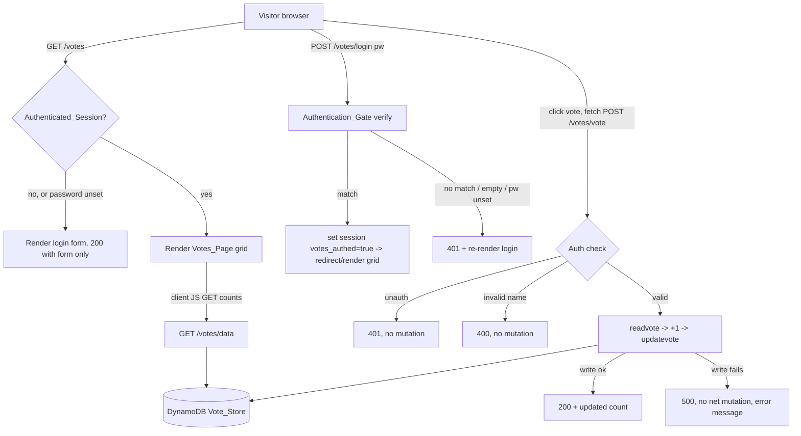

# Design Document: votes-web-page

## Overview

This feature adds a dedicated, password-protected web page at `/votes` to the
existing single-file VotingApp Flask application (`app.py`). The page renders a
modern, responsive HTML/CSS/JS interface that displays the four fixed
restaurants (`outback`, `bucadibeppo`, `ihop`, `chipotle`) and their current
vote counts in a grid, and lets an authenticated Visitor cast a vote without a
full page reload. Votes are persisted through the application's existing
DynamoDB-backed helpers (`readvote`, `updatevote`).

The design is intentionally additive and minimally invasive:

- All existing routes (`/`, `/api/<restaurant>`, `/api/getvotes`,
  `/api/getheavyvotes`) remain **byte-for-byte unchanged** in behavior
  (Requirement 1.4). The existing `/api/*` routes stay unauthenticated and keep
  their CORS configuration.
- New functionality is layered in as additional routes plus a small set of
  helpers inside the same `app.py`, preserving the single-file structure and the
  Flask 2.0.3 / Werkzeug 2.2.2 runtime already pinned in `requirements.txt`.
- A new environment variable, `VOTES_PASSWORD`, gates access. The system
  **fails closed**: if it is unset or empty, every `/votes` interaction returns
  401.

### Resolved Design Decisions

**Decision 1 — Authentication mechanism: login form + signed Flask session
cookie (chosen) over HTTP Basic auth.**

Requirement 5 calls for a "modern, rich UI." A login form rendered as part of
the page, backed by Flask's signed session cookie, provides a far better user
experience than the browser's native Basic-auth dialog: it can be styled,
shows inline validation/error states (Requirement 2.3), and avoids the
credential being re-sent on every request. Flask's `session` is a signed
(HMAC, via `itsdangerous`) client-side cookie; setting `app.secret_key` is
required. The session stores only a boolean-style marker
(`session['votes_authed'] = True`) — never the password itself. This approach
is fully supported on Flask 2.0.3 / Werkzeug 2.2.2 with no extra dependencies.

Basic auth was rejected because it cannot satisfy the styled
form/confirmation/error-state UX goals cleanly and ties authentication to the
browser chrome rather than the page.

**Decision 2 — Vote endpoint: add a dedicated, auth-protected page-level
endpoint `POST /votes/vote` (chosen) rather than reusing `/api/<restaurant>`.**

Requirements 2.4 and 4.7 require the page's vote action to be auth-protected and
to reject unauthenticated requests with 401 while never mutating state. The
existing `/api/<restaurant>` routes are unauthenticated and must remain
unchanged (Requirement 1.4), so they cannot carry the auth contract. A
dedicated `POST /votes/vote` endpoint:

- Enforces the Authenticated_Session before any state mutation.
- Returns page-appropriate JSON (`{restaurant, value}`) and the precise status
  codes the requirements demand (200 / 400 / 401 / 500).
- Validates the restaurant name against the fixed allow-list, returning 400 for
  anything else (Requirement 4.6).
- Internally reuses the same `readvote`/`updatevote` helpers, so vote semantics
  stay identical to the API routes (read → +1 → write).

Using POST (not GET) for the mutation is deliberate: it keeps state changes off
idempotent-GET semantics and makes CSRF posture explicit (same-origin form/fetch
with the session cookie).

### Template strategy

Templates are rendered with **`render_template_string`** using inline
constants defined in `app.py`. This preserves the single-file structure (no new
`templates/` directory is introduced), keeps deployment artifacts unchanged, and
is fully supported by Flask 2.0.3. The CSS and client JS are embedded in the
same inline template so no static-asset routing or `static/` wiring is needed.

## Architecture

The Votes_Page lives entirely within the existing Flask process served by AWS
App Runner on container port 8080. It shares the same `boto3` DynamoDB resource
(`ddbtable`) and the same `readvote`/`updatevote` helpers used by the legacy
routes, guaranteeing consistent vote semantics across both surfaces.

### Request surface (new routes)

| Route | Method | Auth | Purpose |
|-------|--------|------|---------|
| `/votes` | GET | Renders login form if unauthenticated; grid if authenticated | Serve Votes_Page (Req 1, 2.1, 3) |
| `/votes/login` | POST | Public (it establishes auth) | Verify password, set session (Req 2.2, 2.3, 2.7) |
| `/votes/logout` | POST/GET | Any | Clear session (supporting/UX) |
| `/votes/data` | GET | Authenticated | Return current counts as JSON for client refresh (Req 3.2, 3.5) |
| `/votes/vote` | POST | Authenticated | Increment one restaurant, return updated count (Req 4) |

All five live under the `/votes` prefix so the legacy `/` and `/api/*` routes are
untouched (Requirement 1.4, 1.5).

## Components and Interfaces

### Authentication_Gate

Responsible for password protection and fail-closed behavior.

- **`get_configured_password()`** → reads `VOTES_PASSWORD` from the environment.
  Returns the raw string or `None`/empty. No default secret is ever assumed.
- **`votes_password_is_configured()`** → `True` only when `VOTES_PASSWORD` is set
  and non-empty after stripping. Used to fail closed (Requirement 2.6).
- **`is_authenticated()`** → `True` only when `votes_password_is_configured()`
  is `True` **and** `session.get('votes_authed') is True`. Tying the session
  check to current configuration ensures that clearing/blanking the password
  invalidates effective access immediately.
- **`verify_password(submitted)`** → returns `True` only when the password is
  configured, the submitted value is non-empty and not whitespace-only, its
  length is ≤ 256, and it matches the Configured_Password byte-for-byte and
  case-sensitively. Comparison uses `hmac.compare_digest` to avoid timing
  leaks (Requirements 2.2, 2.7).
- **`require_votes_auth`** decorator → wraps protected endpoints
  (`/votes/data`, `/votes/vote`); returns 401 (JSON for fetch endpoints) when
  `is_authenticated()` is `False`, before any DynamoDB access
  (Requirements 2.4, 4.7).

`app.secret_key` is set at startup from `SECRET_KEY` env var if present, else a
generated per-process random value (sessions do not need to survive restarts for
this feature; a generated key simply forces re-login after a restart).

### Votes_Page renderer

- **`render_login(error=None, status=200)`** → renders the inline login template
  with an optional error banner. Contains **no** vote counts or vote controls
  (Requirement 2.1). Returns 401 when invoked as a denial.
- **`render_votes_page()`** → renders the inline grid template for an
  authenticated session. The template ships the static grid scaffold plus
  embedded CSS and JS; actual counts are fetched client-side from `/votes/data`
  so a transient read failure degrades gracefully to an inline error rather than
  a broken page (Requirement 3.5).

### Page-level vote endpoint

- **`POST /votes/vote`** (decorated with `require_votes_auth`):
  1. Auth check (else 401, no mutation).
  2. Parse `restaurant` from JSON body (or form field).
  3. Validate against `RESTAURANTS = ["outback","bucadibeppo","ihop","chipotle"]`;
     reject with 400 if not a member (Requirement 4.6) — checked **before** any
     read/write.
  4. `current = int(readvote(restaurant)); updatevote(restaurant, current + 1)`.
  5. On success return `200` with `{"restaurant": name, "value": current+1}`
     (Requirement 4.3).
  6. On any DynamoDB exception during read/write return `500` with a generic
     error body that does not leak configuration details (Requirements 4.5,
     6.6). Because the increment is read-then-write of a single item with no
     partial multi-item operation, a failed write leaves the stored count
     unchanged (Requirement 4.5).

### Data access (reuse)

- **`readvote(restaurant)`** and **`updatevote(restaurant, votes)`** are reused
  unchanged from the existing app. `/votes/data` calls `readvote` for each of
  the four restaurants and returns a JSON array shaped like `/api/getvotes`.

### Client-side JS (embedded)

- On load, `fetch('/votes/data')` populates each restaurant's count cell; on
  non-200 it shows the "counts temporarily unavailable" message and renders no
  numeric values (Requirement 3.5).
- On vote-control activation: disable the control, show a per-control processing
  indicator (Requirement 5.3), `fetch('POST /votes/vote', {restaurant})`.
  - 200 → update only that restaurant's count cell from the response, show a
    success confirmation within 2s (Requirements 3.4, 5.2), re-enable control.
  - 400 → show "selected restaurant is invalid" error; counts unchanged.
  - 401 → show session-expired error and reveal the login form again.
  - 500 → show "vote could not be recorded" error; counts unchanged
    (Requirements 4.5, 5.6).

## Data Models

The feature introduces no new persistent schema; it reuses the existing
Vote_Store.

**Vote_Store (DynamoDB table, default `votingapp-restaurants`)**

| Attribute | Type | Notes |
|-----------|------|-------|
| `name` | String (partition key) | One of the four fixed restaurants |
| `restaurantcount` | Number | Non-negative integer Vote_Count |

**In-process constants / state**

| Name | Shape | Purpose |
|------|-------|---------|
| `RESTAURANTS` | `["outback","bucadibeppo","ihop","chipotle"]` | Fixed allow-list; drives rendering and validation |
| `VOTES_PASSWORD` | env string | Configured_Password (fail closed if unset/empty) |
| `session['votes_authed']` | bool in signed cookie | Authenticated_Session marker |

**HTTP request/response shapes**

- `POST /votes/login` — request: form `password=<str>`; response: 302→`/votes`
  (or 200 grid) on success, 401 login re-render on failure.
- `GET /votes/data` — response 200: `[{"name":"outback","value":N}, ...]`
  (four entries); 401 if unauthenticated; 500 with generic error on read
  failure.
- `POST /votes/vote` — request JSON `{"restaurant":"ihop"}`; response 200
  `{"restaurant":"ihop","value":N}`; 400 invalid name; 401 unauthenticated;
  500 write failure.

## Correctness Properties

*A property is a characteristic or behavior that should hold true across all
valid executions of a system — essentially, a formal statement about what the
system should do. Properties serve as the bridge between human-readable
specifications and machine-verifiable correctness guarantees.*

These properties were derived from the prework analysis above. Rendering and
business-logic invariants were consolidated to remove redundancy: the six grid
rendering criteria (1.3, 3.1, 3.2, 3.3, 4.1, 5.5) collapse into one
comprehensive rendering property; the two unauthenticated-no-mutation criteria
(2.4, 4.7) collapse into one; the successful-vote criteria (4.2, 4.3, and the
data part of 3.4) collapse into one increment property; and the two
invalid-password criteria (2.3, 2.7) collapse into one denial property.

### Property 1: Authenticated grid renders the complete, correct restaurant set

*For any* vector of four non-negative integer vote counts read from the
Vote_Store, the rendered authenticated Votes_Page SHALL contain exactly four
rows — one per restaurant (`outback`, `bucadibeppo`, `ihop`, `chipotle`), each
appearing exactly once — where each restaurant's label is co-located in the same
row as a displayed count equal to that restaurant's stored count, exactly four
vote controls are present (one per restaurant), and each vote control carries an
accessible label naming its restaurant.

**Validates: Requirements 1.3, 3.1, 3.2, 3.3, 4.1, 5.5**

### Property 2: Unauthenticated page exposes no counts or controls

*For any* request to `/votes` that lacks a valid Authenticated_Session, the
rendered response SHALL contain no numeric Vote_Count value and no vote control
element (it shows only the password entry form).

**Validates: Requirements 2.1**

### Property 3: Correct password grants a session

*For any* configured non-empty password of length ≤ 256, submitting that exact
byte-for-byte, case-sensitive value SHALL cause `verify_password` to return true
and establish an Authenticated_Session.

**Validates: Requirements 2.2**

### Property 4: Any non-matching, empty, or whitespace-only password is denied

*For any* configured password and *for any* submitted value that is not
byte-for-byte equal to it (including the empty string, whitespace-only strings,
and values longer than 256 characters), the Authentication_Gate SHALL deny
access, SHALL NOT establish a session, and SHALL respond with HTTP status 401.

**Validates: Requirements 2.3, 2.7**

### Property 5: Fail closed when password is unset or empty

*For any* `/votes` interaction and *for any* session state, when the
`VOTES_PASSWORD` environment variable is unset or empty, the VotingApp SHALL
deny access with HTTP status 401 and SHALL NOT modify any Vote_Count.

**Validates: Requirements 2.6**

### Property 6: Unauthenticated vote requests never mutate state

*For any* restaurant name and *for any* starting Vote_Store state, a vote request
made without a valid Authenticated_Session SHALL return HTTP status 401 and leave
all four Vote_Counts unchanged.

**Validates: Requirements 2.4, 4.7**

### Property 7: A successful vote increments the target by exactly one

*For any* valid restaurant and *for any* current Vote_Count n, a successful
authenticated vote SHALL result in a stored Vote_Count of n+1 for that
restaurant, return HTTP status 200, and return the updated value n+1 to the
page.

**Validates: Requirements 4.2, 4.3, 3.4**

### Property 8: Voting changes only the targeted restaurant

*For any* targeted restaurant and *for any* starting vector of four Vote_Counts,
after a successful vote the three non-targeted restaurants' Vote_Counts SHALL be
unchanged.

**Validates: Requirements 4.4**

### Property 9: Invalid restaurant names are rejected without mutation

*For any* string that is not one of the four fixed restaurants, a vote request
SHALL return HTTP status 400 and leave all four Vote_Counts unchanged.

**Validates: Requirements 4.6**

### Property 10: Write failures return 500 without mutation or config leakage

*For any* valid restaurant, when the Vote_Store write does not succeed, the vote
request SHALL return HTTP status 500, leave all four Vote_Counts unchanged, and
return an error body that does not expose internal configuration details (region,
table name, or stack internals).

**Validates: Requirements 4.5, 6.6**

### Property 11: Read failures hide all counts behind an error message

*For any* page render or count fetch, when the Vote_Store read fails, the
response SHALL present the "counts temporarily unavailable" error and SHALL
contain no partial or stale numeric Vote_Count values, without exposing internal
configuration details.

**Validates: Requirements 3.5, 6.6**

## Error Handling

| Condition | Detection | Response | Counts | Requirement |
|-----------|-----------|----------|--------|-------------|
| Password env unset/empty | `votes_password_is_configured()` false | 401 + login form (or generic deny) | unchanged | 2.6 |
| No session on `/votes` GET | `is_authenticated()` false | 200 login form, no counts/controls | unchanged | 2.1 |
| Wrong/empty/whitespace password | `verify_password` false | 401 + login re-render with error banner | unchanged | 2.3, 2.7 |
| No session on `/votes/vote` or `/votes/data` | `require_votes_auth` | 401 JSON | unchanged | 2.4, 4.7 |
| Invalid restaurant name | not in `RESTAURANTS` (checked pre-read) | 400 JSON error | unchanged | 4.6 |
| DynamoDB read failure | exception in `readvote` | 500 / inline "counts unavailable"; no numbers | unchanged | 3.5, 6.6 |
| DynamoDB write failure | exception in `updatevote` | 500 JSON "vote could not be recorded" | unchanged | 4.5, 6.6 |
| Store/IAM unavailable | boto3/ClientError | generic 500, no internal config in body | unchanged | 6.6 |

Error principles:
- **Validate before mutate**: auth and allow-list checks run before any
  DynamoDB read/write, so rejected requests provably cannot change state.
- **Fail closed**: missing/empty `VOTES_PASSWORD` denies everyone.
- **No information leakage**: error bodies are generic strings; exception detail
  is logged server-side only (via existing `print`/OTel), never returned to the
  client (Requirement 6.6).
- **Client-side resilience**: the page renders its scaffold first and fetches
  counts asynchronously, so a read failure shows an inline error rather than a
  broken page.

## Testing Strategy

### Dual approach

- **Property-based tests** verify the universal invariants in the Correctness
  Properties section across many generated inputs.
- **Example / unit tests** cover specific behaviors and edge cases: header
  values (1.1, 1.2), legacy-route regression (1.4), routing exclusivity (1.5),
  semantic-markup presence (5.4), and environment sourcing (2.5).
- **Integration & smoke tests** cover deployment and UI evidence (Requirements 6
  and 7), which depend on the live AWS environment and a real browser.

### Property-based testing

PBT **is appropriate** here because the auth verification, vote-increment, count
non-interference, validation, and rendering behaviors are pure-logic functions
with large/varied input spaces (arbitrary counts, arbitrary submitted passwords,
arbitrary restaurant strings). DynamoDB access is **mocked** in property tests so
100+ iterations stay fast and deterministic; the read/write helpers are wrapped
behind a thin seam (or `moto`/a stub `ddbtable`) the tests control.

- Library: **Hypothesis** (Python), the standard PBT library for this stack — do
  not hand-roll generators.
- Each property test runs a **minimum of 100 iterations**.
- Each property test is tagged with a comment referencing its design property in
  the format: **Feature: votes-web-page, Property {number}: {property_text}**.
- Each of the 11 correctness properties is implemented by a **single**
  property-based test:
  - Generators: non-negative integer count vectors (Properties 1, 7, 8, 11);
    arbitrary text and whitespace/over-length strings for passwords
    (Properties 3, 4); arbitrary non-allow-list strings for restaurant names
    (Property 9); session-present/absent flags (Properties 2, 5, 6); injected
    read/write failures (Properties 10, 11).

### Example / unit tests

- Authenticated `GET /votes` → 200, `Content-Type: text/html` (1.1, 1.2).
- Legacy routes (`/`, `/api/<restaurant>`, `/api/getvotes`,
  `/api/getheavyvotes`) unchanged (1.4); non-`/votes` paths never serve the page
  (1.5).
- Rendered markup uses semantic elements (table/section/button) (5.4).
- Gate reads `VOTES_PASSWORD` from the environment (2.5).

### Deployment integration & smoke tests (Requirement 6)

- Run `preparation/prepare.sh` first to create the `votingapp-restaurants` table
  and `votingapp-role` (6.5).
- Deploy via `apprunner.yaml` on container port 8080 with `VOTES_PASSWORD`,
  `DDB_AWS_REGION`, and `DDB_TABLE_NAME` set (6.2, 6.3).
- Smoke test: authenticated `GET /votes` over HTTPS returns 200 within 5s
  (6.1, 6.4); store-unavailable path returns a generic error (6.6).

### UI validation & Evidence_Document (Requirement 7)

Browser-driven tests use the available **Playwright MCP tools** against the live
Deployment:

1. Navigate to `/votes`, confirm full render within 30s; on timeout record a
   load failure and halt (7.1, 7.2).
2. Capture a screenshot of the password prompt **before** any count is shown
   (7.3).
3. Authenticate, capture a screenshot of the grid showing all four restaurants
   with visible counts (7.4).
4. Cast one vote and capture a screenshot showing the target's count increased
   by exactly 1 versus the pre-vote value (7.5).
5. Verify responsive layout (no horizontal grid scroll) at 360px and 1280px
   viewports, processing indicator during the request, and success confirmation
   within 2s (5.1, 5.2, 5.3).

The **Evidence_Document** is a markdown file stored in the repository that embeds
each screenshot and records a pass/fail status with the observed outcome per
step; any failed step records the step, expected behavior, and observed behavior,
and the work is not considered complete (7.6, 7.7, 7.8).

## Requirements Coverage Map

| Requirement | Covered by design elements |
|-------------|----------------------------|
| 1. Serve the Votes Page | `GET /votes` route, `render_votes_page`, single-file additive routing, Property 1 |
| 2. Password Protection | Authentication_Gate (`verify_password`, `is_authenticated`, `require_votes_auth`), Flask signed session, fail-closed; Properties 2–6 |
| 3. Display Vote Counts | Inline grid template + `/votes/data`, client JS DOM update; Properties 1, 7, 11 |
| 4. Cast a Vote | `POST /votes/vote` with auth + allow-list validation, reuse of readvote/updatevote; Properties 6–10 |
| 5. Modern Rich UI | Responsive CSS grid, semantic HTML, aria-labels, processing/confirmation/error states; Property 1 + Playwright examples |
| 6. Deploy to AWS | apprunner.yaml (port 8080), `VOTES_PASSWORD`/`DDB_*` env, prepare.sh, HTTPS; integration/smoke tests, Property 10/11 no-leak |
| 7. Validate & Document | Playwright UI tests + Evidence_Document markdown; integration tests |
