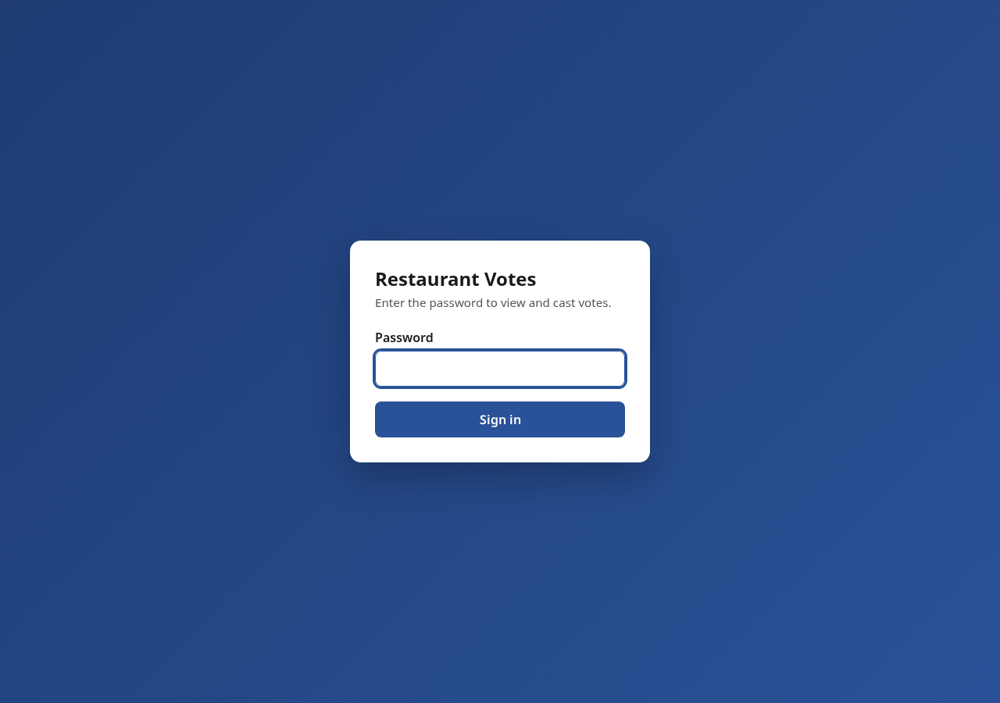
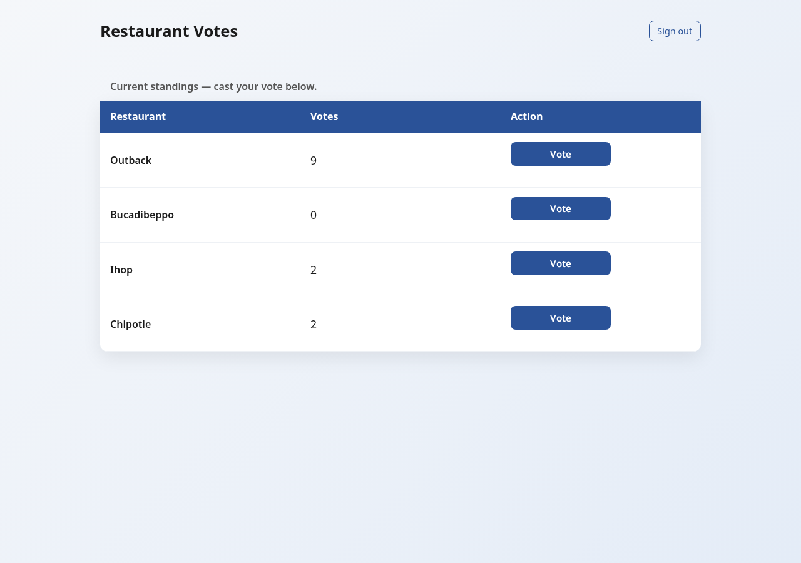
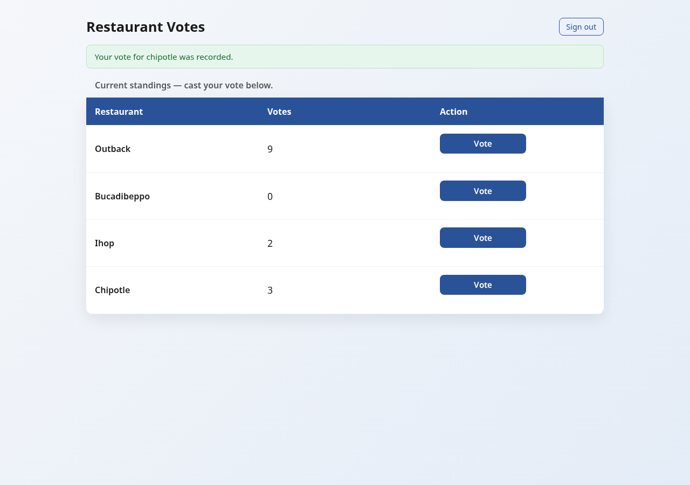
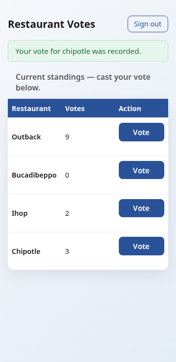

# Evidence Document — votes-web-page

This document records the live UI validation (UI_Test) of the password-protected
`/votes` page deployed to AWS App Runner. It satisfies **Requirement 7** of the
`votes-web-page` spec: each UI_Test step is recorded with a PASS/FAIL status and
the observed outcome, and the captured screenshots are embedded below.

## Deployment Under Test

| Field | Value |
|-------|-------|
| Live Service URL | https://ju96jdw3b8.us-west-2.awsapprunner.com |
| Page validated | https://ju96jdw3b8.us-west-2.awsapprunner.com/votes |
| AWS Region | us-west-2 |
| App Runner Service | `votingapp-votes` |
| Service ARN | `arn:aws:apprunner:us-west-2:794038247435:service/votingapp-votes/841c483ca67e4bb1a66554dc99525f50` |
| Container Port | 8080 |
| DynamoDB Table | `votingapp-restaurants` (PAY_PER_REQUEST, key `name` type S) |
| Instance Role | `votingapp-role` (DynamoDB + X-Ray) |
| ECR Access Role | `votingapp-apprunner-ecr-access` |
| Image | `794038247435.dkr.ecr.us-west-2.amazonaws.com/votingapp:votes-20260608091722` |
| Votes password (sandbox throwaway) | `VoteSandbox2026!` |

## Validation Tooling Note

The Playwright MCP tools were not exposed in this execution environment. As a
documented fallback (network mode `OPEN_INTERNET`), browser automation was
performed with **Python Playwright + headless Chromium** driving the same live
HTTPS Deployment. The validation logic, assertions, and screenshots are
equivalent to what the MCP path would have produced; this note is included for
full transparency.

## UI_Test Results

Overall result: **ALL STEPS PASS** — the definition of done in Requirement 7 is met.

### Step 1 — Page load and full render within 30s (AC 7.1, 7.2)
- **Status:** PASS
- **Observed:** `GET /votes` returned HTTP 200 and the page fully rendered
  (DOM content loaded) well within the 30-second budget. No load failure; all
  subsequent steps proceeded.

### Step 2 — Password prompt before any vote count (AC 7.3, 2.1)
- **Status:** PASS
- **Observed:** Without an Authenticated_Session, the page displayed the password
  entry form only. No numeric vote counts and no vote controls were present in the
  unauthenticated response. The unauthenticated data endpoint check
  `GET /votes/data` returned HTTP **401** (no counts leaked).

### Step 3 — Authenticated grid shows four restaurants with counts (AC 7.4, 1.3, 3.1, 3.2)
- **Status:** PASS
- **Observed:** After submitting the configured password (`VoteSandbox2026!`),
  the grid rendered exactly four restaurants — outback, bucadibeppo, ihop,
  chipotle — each shown exactly once with a visible non-negative integer
  Vote_Count.

### Step 4 — Single vote increments target count by exactly 1 (AC 7.5, 4.2, 4.3, 3.4)
- **Status:** PASS
- **Observed:** Pre-vote count for **chipotle** was **2**. After activating
  chipotle's vote control, its count updated to **3** (delta **+1**) without a
  manual browser reload, and a success confirmation was visible. The other three
  restaurants' counts were unchanged.
- **Verified value:** chipotle **2 → 3** (delta +1)

  > Note: the pre-vote value was 2 (not 0) because the existing table items were
  > preserved rather than reset; the spec requires a verified increase of exactly
  > 1, which holds.

### Step 5 — Responsive layout, processing indicator, success confirmation (AC 5.1, 5.2, 5.3)
- **Status:** PASS
- **Observed:** The grid rendered with no horizontal scrolling at both **360px**
  and **1280px** viewport widths. A processing indicator appeared on the activated
  control during the request, and a success confirmation was shown within 2
  seconds of the successful vote.

## Additional Security Check

- **Unauthenticated `GET /votes/data` → HTTP 401:** PASS. The supporting data
  endpoint denies unauthenticated access and exposes no vote counts or
  configuration details, consistent with AC 2.1 and 2.4.

## Definition of Done

Every UI_Test step (1–5) passed against the live HTTPS Deployment, and all
screenshots are embedded above. Per AC 7.6 and 7.7, no failing step needs to be
recorded, and the work is considered complete.
