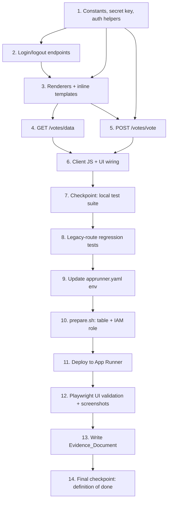

# Implementation Plan: votes-web-page

## Overview

This plan implements a password-protected `/votes` web page in the existing
single-file Flask app (`app.py`). All work is **additive**: new routes and
helpers are layered into `app.py` without altering the existing `/`, `/api/*`,
`readvote`, or `updatevote` code paths. Implementation proceeds bottom-up — the
Authentication_Gate helpers first, then the page renderers and templates, then
the JSON data/vote endpoints, then the client JS that wires the UI together.
Property-based tests (Hypothesis, mocked DynamoDB, ≥100 iterations) and
example/unit/regression tests validate the logic. Finally the feature is
deployed to AWS App Runner and the live UI is validated with Playwright,
producing a markdown Evidence_Document that constitutes the proof-of-done.

Implementation language: **Python** (matches existing `app.py`; Flask 2.0.3 /
Werkzeug 2.2.2 as pinned in `requirements.txt`).

## Tasks

- [x] 1. Set up shared constants, app secret key, and the Authentication_Gate helpers
  - In `app.py`, add `import hmac` and `import secrets`, and add the
    `RESTAURANTS = ["outback","bucadibeppo","ihop","chipotle"]` constant.
  - Set `app.secret_key` from a `SECRET_KEY` env var if present, otherwise a
    per-process `secrets.token_hex()` value (so Flask signed sessions work).
  - Implement `get_configured_password()` (reads `VOTES_PASSWORD` from env,
    returns the raw string or `None`).
  - Implement `votes_password_is_configured()` (True only when `VOTES_PASSWORD`
    is set and non-empty after stripping) — fail-closed basis.
  - Implement `is_authenticated()` (True only when password is configured AND
    `session.get('votes_authed') is True`).
  - Implement `verify_password(submitted)` using `hmac.compare_digest`, returning
    True only when password is configured, submitted is non-empty/not
    whitespace-only, length ≤ 256, and matches byte-for-byte case-sensitively.
  - Implement the `require_votes_auth` decorator that returns a 401 JSON response
    before any DynamoDB access when `is_authenticated()` is False.
  - Do NOT modify existing routes, `readvote`, `updatevote`, or the CORS config.
  - _Requirements: 2.5, 2.6, 1.4_

  - [x]* 1.1 Write property test for password configuration / fail-closed behavior
    - **Property 5: Fail closed when password is unset or empty**
    - Generate arbitrary session states; with `VOTES_PASSWORD` unset/empty,
      assert `is_authenticated()` is False and gated access is denied (401).
    - Hypothesis, ≥100 iterations, mocked env; tag comment
      `Feature: votes-web-page, Property 5: ...`.
    - _Requirements: 2.6_

  - [x]* 1.2 Write property test for correct-password acceptance
    - **Property 3: Correct password grants a session**
    - Generate configured non-empty passwords (length ≤ 256); assert submitting
      the exact value makes `verify_password` return True.
    - Hypothesis, ≥100 iterations; tag `Feature: votes-web-page, Property 3: ...`.
    - _Requirements: 2.2_

  - [x]* 1.3 Write property test for password denial
    - **Property 4: Any non-matching, empty, or whitespace-only password is denied**
    - Generate a configured password plus submitted values not byte-equal to it
      (including empty, whitespace-only, and >256-char strings); assert
      `verify_password` returns False (and the gate responds 401, no session).
    - Hypothesis, ≥100 iterations; tag `Feature: votes-web-page, Property 4: ...`.
    - _Requirements: 2.3, 2.7_

  - [x]* 1.4 Write unit test for environment sourcing of the password
    - Assert `get_configured_password()` reads `VOTES_PASSWORD` from the
      environment (set/unset/empty cases).
    - _Requirements: 2.5_

- [x] 2. Implement the login/logout endpoints
  - Add `POST /votes/login`: read the `password` form field, call
    `verify_password`; on success set `session['votes_authed'] = True` and
    redirect to `/votes` (302); on failure re-render the login form with an
    error banner and HTTP status 401. Do not establish a session on failure.
  - Add `/votes/logout` (POST/GET): clear `session['votes_authed']`.
  - Reference the inline login template created in Task 3 (`render_login`).
  - _Requirements: 2.2, 2.3, 2.7_

  - [x]* 2.1 Write example tests for login outcomes
    - Correct password → 302 to `/votes` and session marker set.
    - Wrong/empty/whitespace password → 401, login re-rendered, no session.
    - _Requirements: 2.2, 2.3, 2.7_

- [x] 3. Implement the Votes_Page renderers and inline templates
  - Add a `LOGIN_TEMPLATE` inline string (semantic HTML form + embedded CSS) and
    `render_login(error=None, status=200)` that renders it with an optional error
    banner and **no** vote counts or vote controls; return 401 when used as a
    denial.
  - Add a `VOTES_TEMPLATE` inline string (semantic HTML grid scaffold with one
    row per restaurant, one vote control per restaurant carrying an accessible
    `aria-label`, embedded CSS, embedded JS placeholder) and
    `render_votes_page()` for authenticated sessions. Counts are fetched
    client-side (filled in Task 6), so the scaffold renders before data loads.
  - Embedded CSS MUST keep the grid free of horizontal scroll at 360px and
    1280px viewports.
  - Add `GET /votes`: if `is_authenticated()` is False (or password unset),
    return `render_login()` (200 form-only when unset/no session); otherwise
    return `render_votes_page()` with `Content-Type: text/html`.
  - _Requirements: 1.1, 1.2, 1.3, 1.5, 2.1, 3.1, 3.3, 4.1, 5.1, 5.4, 5.5_

  - [x]* 3.1 Write property test for authenticated grid rendering
    - **Property 1: Authenticated grid renders the complete, correct restaurant set**
    - Generate vectors of four non-negative integer counts; assert the rendered
      authenticated page contains exactly four rows (each restaurant once), each
      label co-located with its count, four vote controls, and an accessible
      label per control.
    - Hypothesis, ≥100 iterations, mocked count source; tag
      `Feature: votes-web-page, Property 1: ...`.
    - _Requirements: 1.3, 3.1, 3.2, 3.3, 4.1, 5.5_

  - [x]* 3.2 Write property test for unauthenticated page exposing no data
    - **Property 2: Unauthenticated page exposes no counts or controls**
    - Generate requests lacking a valid session; assert the response contains no
      numeric count and no vote control element (login form only).
    - Hypothesis, ≥100 iterations; tag `Feature: votes-web-page, Property 2: ...`.
    - _Requirements: 2.1_

  - [x]* 3.3 Write example tests for headers, routing exclusivity, and semantic markup
    - Authenticated `GET /votes` → 200 with `Content-Type: text/html` (1.1, 1.2).
    - Non-`/votes` paths never serve the Votes_Page (1.5).
    - Rendered markup uses semantic elements (table/section/button) (5.4).
    - _Requirements: 1.1, 1.2, 1.5, 5.4_

- [x] 4. Implement the `GET /votes/data` count endpoint
  - Add `GET /votes/data` decorated with `require_votes_auth`: call `readvote`
    for each of the four restaurants and return a JSON array shaped like
    `/api/getvotes` (`[{"name":"outback","value":N}, ...]`) with status 200.
  - On any DynamoDB read exception, return 500 with a generic error body (no
    region/table/stack details) so the client shows "counts temporarily
    unavailable" and no partial/stale numbers.
  - Reuse `readvote` unchanged.
  - _Requirements: 3.2, 3.5, 6.6, 2.4_

  - [x]* 4.1 Write property test for read-failure handling
    - **Property 11: Read failures hide all counts behind an error message**
    - Generate count vectors and inject read failures; assert the response
      presents the unavailable-counts error, contains no numeric values, and
      leaks no config details.
    - Hypothesis, ≥100 iterations, mocked `readvote`; tag
      `Feature: votes-web-page, Property 11: ...`.
    - _Requirements: 3.5, 6.6_

- [x] 5. Implement the `POST /votes/vote` increment endpoint
  - Add `POST /votes/vote` decorated with `require_votes_auth`.
  - Order of operations (validate-before-mutate): (1) auth check via decorator
    (else 401, no mutation); (2) parse `restaurant` from JSON body (or form);
    (3) validate against `RESTAURANTS`, returning 400 with an "invalid
    restaurant" body **before** any read/write if not a member; (4)
    `current = int(readvote(restaurant))` then `updatevote(restaurant, current+1)`;
    (5) on success return 200 with `{"restaurant": name, "value": current+1}`.
  - On any DynamoDB read/write exception, return 500 with a generic
    "vote could not be recorded" body that leaks no config details; the
    single-item read-then-write leaves the stored count unchanged on failure.
  - Reuse `readvote`/`updatevote` unchanged.
  - _Requirements: 4.2, 4.3, 4.4, 4.5, 4.6, 4.7, 2.4, 6.6_

  - [x]* 5.1 Write property test for unauthenticated no-mutation
    - **Property 6: Unauthenticated vote requests never mutate state**
    - Generate restaurant names and starting store states; assert an
      unauthenticated vote returns 401 and leaves all four counts unchanged.
    - Hypothesis, ≥100 iterations, mocked store; tag
      `Feature: votes-web-page, Property 6: ...`.
    - _Requirements: 2.4, 4.7_

  - [x]* 5.2 Write property test for successful increment
    - **Property 7: A successful vote increments the target by exactly one**
    - Generate valid restaurant + current count n; assert stored count becomes
      n+1, status 200, and returned value is n+1.
    - Hypothesis, ≥100 iterations, mocked store; tag
      `Feature: votes-web-page, Property 7: ...`.
    - _Requirements: 4.2, 4.3, 3.4_

  - [x]* 5.3 Write property test for non-interference
    - **Property 8: Voting changes only the targeted restaurant**
    - Generate a target restaurant and a starting vector of four counts; assert
      the three non-targeted counts are unchanged after a successful vote.
    - Hypothesis, ≥100 iterations, mocked store; tag
      `Feature: votes-web-page, Property 8: ...`.
    - _Requirements: 4.4_

  - [x]* 5.4 Write property test for invalid-name rejection
    - **Property 9: Invalid restaurant names are rejected without mutation**
    - Generate strings not in the four-restaurant allow-list; assert status 400
      and all four counts unchanged.
    - Hypothesis, ≥100 iterations, mocked store; tag
      `Feature: votes-web-page, Property 9: ...`.
    - _Requirements: 4.6_

  - [x]* 5.5 Write property test for write-failure handling
    - **Property 10: Write failures return 500 without mutation or config leakage**
    - Generate valid restaurants and inject write failures; assert status 500,
      all four counts unchanged, and a generic error body (no config leakage).
    - Hypothesis, ≥100 iterations, mocked store; tag
      `Feature: votes-web-page, Property 10: ...`.
    - _Requirements: 4.5, 6.6_

- [x] 6. Implement the embedded client-side JS and wire the UI together
  - In `VOTES_TEMPLATE`, embed JS that on load `fetch('/votes/data')` and
    populates each restaurant's count cell; on non-200 show the "counts
    temporarily unavailable" message and render no numeric values.
  - On vote-control activation: disable the control, show a per-control
    processing indicator (5.3), `fetch('POST /votes/vote', {restaurant})`:
    - 200 → update only that restaurant's count cell from the response, show a
      success confirmation within 2s (3.4, 5.2), re-enable the control.
    - 400 → show "selected restaurant is invalid"; counts unchanged.
    - 401 → show session-expired error and reveal the login form.
    - 500 → show "vote could not be recorded"; counts unchanged (4.5, 5.6).
  - Ensure no full page reload is required for count updates (3.4).
  - _Requirements: 3.4, 3.5, 4.5, 5.2, 5.3, 5.6_

- [x] 7. Checkpoint - run the full local test suite
  - Run all property tests and example/unit tests; ensure all pass.
  - Ensure all tests pass, ask the user if questions arise.

- [x] 8. Add legacy-route regression tests
  - [x]* 8.1 Write regression tests confirming existing routes are unchanged
    - Assert `/`, `/api/outback`, `/api/bucadibeppo`, `/api/ihop`,
      `/api/chipotle`, `/api/getvotes`, and `/api/getheavyvotes` retain their
      current behavior and response shapes (mocked store), and remain
      unauthenticated with existing CORS on `/api/*`.
    - _Requirements: 1.4_

- [x] 9. Update deployment configuration for the new environment variable
  - Update `apprunner.yaml` so the App Runner service supplies a non-empty
    `VOTES_PASSWORD` env var (alongside the existing `DDB_AWS_REGION`; keep
    container port 8080 and `DDB_TABLE_NAME` default `votingapp-restaurants`).
  - Confirm `requirements.txt` already covers runtime deps; add Hypothesis as a
    test-only dependency note (not bundled into the App Runner runtime install).
  - _Requirements: 6.2, 6.3_

- [x] 10. Prepare AWS prerequisites (DynamoDB table + IAM role)
  - Run `preparation/prepare.sh` to create and initialize the
    `votingapp-restaurants` table (four restaurants seeded at 0) and the
    `votingapp-role` IAM role before the App Runner service starts.
  - Confirm the table and role exist and the four seed items are present.
  - _Requirements: 6.5_

- [x] 11. Deploy to AWS App Runner
  - Deploy the updated app via `apprunner.yaml` (container port 8080) with
    `VOTES_PASSWORD`, `DDB_AWS_REGION` (us-west-2), and `DDB_TABLE_NAME`
    (votingapp-restaurants) set, attaching `votingapp-role`.
  - Confirm the service reaches a running state and serves over HTTPS.
  - _Requirements: 6.1, 6.2, 6.3, 6.4_

  - [ ]* 11.1 Write deployment smoke test
    - Authenticated `GET /votes` over HTTPS returns 200 within 5s; confirm the
      store-unavailable path returns a generic error with no config leakage.
    - _Requirements: 6.1, 6.4, 6.6_

- [x] 12. Validate the live UI with Playwright and capture screenshots
  - Using the Playwright MCP tools against the live Deployment:
    - Navigate to `/votes`; confirm full render within 30s. On timeout, record a
      load failure and halt remaining steps (7.1, 7.2).
    - Capture a screenshot of the password prompt **before** any count is shown
      (7.3).
    - Authenticate, then capture a screenshot of the grid showing all four
      restaurants each with a visible count (7.4).
    - Cast a single vote and capture a screenshot showing that restaurant's count
      increased by exactly 1 versus the pre-vote value (7.5).
    - Verify responsive layout (no horizontal grid scroll) at 360px and 1280px,
      the processing indicator during the request, and success confirmation
      within 2s (5.1, 5.2, 5.3).
  - _Requirements: 7.1, 7.2, 7.3, 7.4, 7.5, 5.1, 5.2, 5.3_

- [x] 13. Write the Evidence_Document markdown
  - Create a markdown Evidence_Document stored in the repository that embeds each
    captured screenshot and records, per UI_Test step, a pass/fail status with
    the observed outcome.
  - For any failed step, record the specific step, the expected behavior, and the
    observed behavior; the work is not complete until every step passes.
  - _Requirements: 7.6, 7.7, 7.8_

- [x] 14. Final checkpoint - confirm definition of done
  - Confirm all local tests pass, the live Deployment serves `/votes` over HTTPS,
    and the Evidence_Document records all UI_Test steps as passing.
  - Ensure all tests pass, ask the user if questions arise.

## Task Dependency Graph



## Notes

- Tasks marked with `*` are optional sub-tasks (tests) and can be skipped for a
  faster MVP; core implementation, deployment, and evidence tasks are not
  optional.
- All 11 correctness properties from the design are each implemented by a single
  property-based test (Hypothesis, ≥100 iterations, mocked DynamoDB) and tagged
  `Feature: votes-web-page, Property N: ...`.
- All `/votes*` work is additive to `app.py`; existing `/`, `/api/*`,
  `readvote`, and `updatevote` are not modified (Requirement 1.4).
- Requirement 7's Evidence_Document is the user's definition of done: deployment
  and live-UI validation tasks (10–13) are mandatory, not optional.
- Each task references the specific requirement sub-clauses it satisfies for
  traceability.
```

## Requirements Coverage

| Requirement | Tasks |
|-------------|-------|
| 1. Serve the Votes Page | 1, 3, 3.1, 3.3, 8.1 |
| 2. Password Protection | 1, 1.1–1.4, 2, 2.1, 3, 3.2, 4, 5.1 |
| 3. Display Vote Counts | 3, 3.1, 4, 4.1, 6 |
| 4. Cast a Vote | 5, 5.1–5.5, 6 |
| 5. Modern Rich UI | 3, 3.1, 3.3, 6, 12 |
| 6. Deploy to AWS | 4, 4.1, 5, 5.5, 9, 10, 11, 11.1 |
| 7. Validate & Document | 12, 13 |
